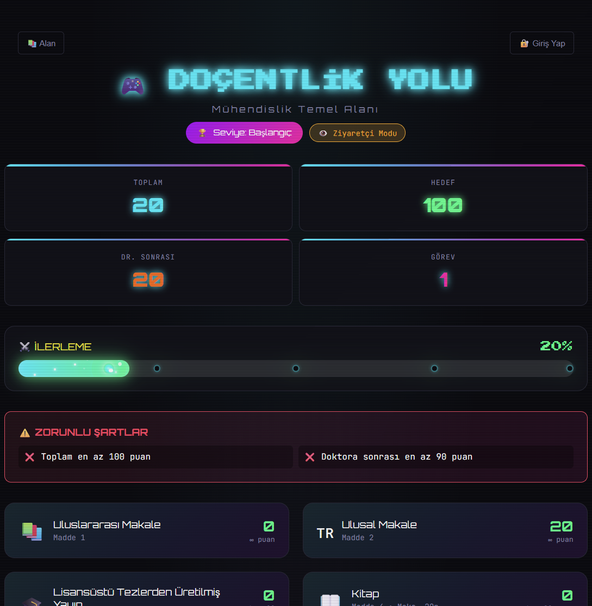
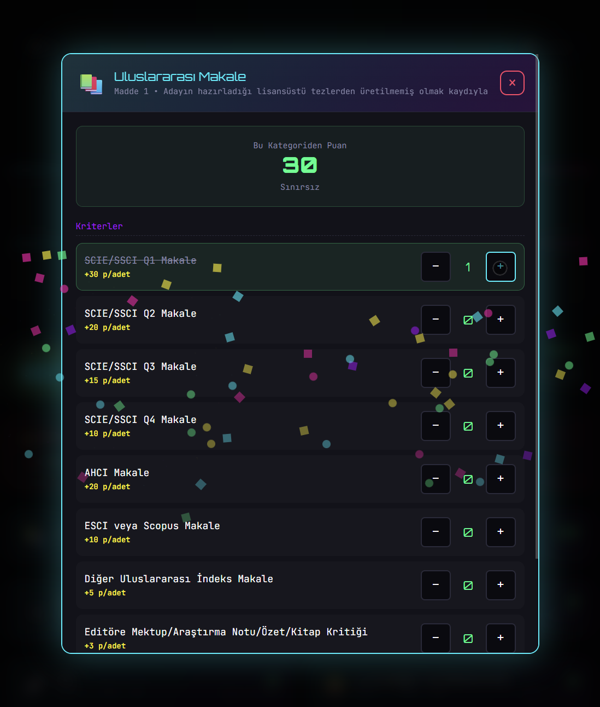

# 🎮 Doçentlik Yolu

**Kişisel Akademik İlerleme Takip Sistemi** - Retro oyun tarzında, ÜAK (Üniversitelerarası Kurul) doçentlik kriterlerini takip etmek için geliştirilmiş, tek kullanıcılı web uygulaması.

[](LICENSE)
[](https://www.php.net/)
[](https://developer.mozilla.org/en-US/docs/Web/JavaScript)
[](https://web.dev/progressive-web-apps/)

---

## 📸 Ekran Görüntüleri

### Ana Ekran - Uzay Oyunu Teması

*Progress bar'da roket egzozu efekti, milestone noktaları ve oyunsu UI*

### Çalışma Ekleme Modalı

*Kriterleri checkbox ve sayaç ile kolayca takip edin*

---

## ✨ Özellikler

### 🎯 Temel Özellikler
- **📊 İlerleme Takibi**: Doçentlik kriterlerinizi oyun gibi takip edin
- **🎮 Oyunsu UI/UX**: Retro uzay oyunu temalı, neon renkli arayüz
- **👁️ Ziyaretçi Modu**: Giriş yapmadan keşfedin (veriler kaydedilmez)
- **👤 Tek Kullanıcı Girişi**: Basit oturum tabanlı kimlik doğrulama
- **📱 PWA Desteği**: Mobil cihazlara "Ana Ekrana Ekle" özelliği
- **🔄 Multi-Alan Desteği**: 
  - Mühendislik Temel Alanı
  - Sosyal, Beşeri ve İdari Bilimler

### 🚀 Görsel Efektler
- **⚡ Enerji Akışı**: Progress bar'da soldan sağa akan shimmer efekti
- **🔥 Roket Egzozu**: Bar ucunda 360° patlayan kıvılcımlar
- **✨ Enerji Parçacıkları**: Bar içinde akan mini parçacıklar
- **💫 Pulsing Glow**: Nabız gibi parlayan bar efekti
- **🎯 Milestone Kutlamaları**: %25, %50, %75, %100 geçişlerinde özel efektler
- **🎊 Konfeti**: Önemli milestone'larda konfeti patlaması
- **🏆 Başarımlar**: İlerlemenize göre kilitlenen achievement'lar

### 🆕 Yeni Özellikler (v2.0)
- **👀 Sadece Görüntüleme Modu**: Ziyaretçiler admin'in ilerlemesini CV formatında inceleyebilir (düzenleme yapılamaz)
- **✍️ Yazar Bazlı Puanlama**: Makaleler için yazar sayısı ve sırasına göre (Başlıca/İkinci/Diğer) otomatik puan hesaplama
- **🔧 Demo Modu**: "Sistemi Kurcala" seçeneği ile veriler kaydedilmeden sistemi test etme imkanı

---

## 🛠️ Kurulum

### Gereksinimler
- PHP 7.4 veya üzeri
- Bir web sunucusu (Apache, Nginx, veya PHP built-in server)
- Modern web tarayıcı (Chrome, Firefox, Safari, Edge)

2. `config.php` dosyasını düzenleyin ve admin şifrenizi ayarlayın:
   ```php
   define('ADMIN_USERNAME', 'admin');
   define('ADMIN_PASSWORD', 'güçlü_şifreniz'); // Değiştirin!
   ```

### Adım 3: Klasör İzinlerini Ayarlayın
```bash
# data klasörünün yazılabilir olduğundan emin olun
chmod 755 data/
```

### Adım 4: Sunucuyu Başlatın

**PHP Built-in Server ile (Development):**
```bash
php -S localhost:8080
```

**Apache/Nginx ile:**
- Proje klasörünü web sunucunuzun document root'una koyun
- `http://sunucu-adresi/docentlik-yolu` adresinden erişin

---

## 📖 Kullanım

### 🔐 Giriş Yapma

1. **Admin Girişi:**
   - Kullanıcı Adı: `admin` (varsayılan)
   - Şifre: `config.php`'de belirlediğiniz şifre
   - Verileriniz JSON dosyasına kaydedilir

2. **Ziyaretçi Modu:**
   - "Ziyaretçi Olarak Devam" butonuna tıklayın
   - Tüm özellikleri deneyebilirsiniz
   - ⚠️ Veriler kaydedilmez!

### 🎯 Alan Seçimi

Sol üstteki **"📚 Alan"** butonuna tıklayarak akademik alanınızı seçin:
- **Mühendislik Temel Alanı** (`muhendislik.json`)
- **Sosyal, Beşeri ve İdari Bilimler** (`sosyal-bilimler.json`)

### 📊 İlerleme Takibi

1. **Quest Kartları**: Her kriter kategorisi için bir kart görürsünüz
2. **Karta Tıklayın**: Detaylı modal açılır
3. **Kriterleri İşaretleyin**: 
   - ✅ Checkbox: Tek seferlik kriterler (ör: Patent)
   - **+ / -**: Sayılabilir kriterler (ör: Makale sayısı)
4. **Otomatik Kayıt**: Her değişiklik otomatik kaydedilir (admin modunda)

### 🏆 Başarımlar

İlerlemenize göre başarımlar kazanın:
- 👣 **İlk Adım**: 10 puan
- 🌟 **25 Puan**: 25 puan
- 🚀 **Yarı Yol**: 50 puan
- 🔥 **Neredeyse**: 90 puan
- 🎯 **Hedef!**: 100 puan
- 📚 **Yayıncı**: 5 görev tamamla
- 🛡️ **Tam Donanım**: Tüm zorunlu şartlar

---

## 📁 Proje Yapısı

```
docentlik-yolu/
├── index.html              # Ana HTML dosyası
├── api.php                 # Backend API
├── config.php              # Konfigürasyon (GIT'e EKLEME!)
├── config.php.example      # Konfigürasyon şablonu
├── manifest.json           # PWA manifest
├── sw.js                   # Service Worker (PWA)
│
├── css/
│   ├── base.css            # Değişkenler, reset
│   ├── components.css      # UI bileşenleri
│   ├── modal.css           # Modal stilleri
│   ├── animations.css      # Genel animasyonlar
│   ├── mobile.css          # Responsive stiller
│   └── progress-effects.css # Progress bar efektleri
│
├── js/
│   ├── app.js              # Ana uygulama
│   ├── state.js            # Durum yönetimi
│   ├── api.js              # API çağrıları
│   ├── auth.js             # Kimlik doğrulama
│   ├── ui.js               # UI render
│   ├── modal.js            # Modal işlemleri
│   └── effects.js          # Görsel efektler
│
├── kriterler/
│   ├── alanlar.json        # Alan listesi
│   ├── muhendislik.json    # Mühendislik kriterleri
│   └── sosyal-bilimler.json # Sosyal Bilimler kriterleri
│
├── data/
│   └── user_progress_[alan].json  # Kullanıcı verileri (otomatik oluşur)
│
└── icons/
    ├── icon-192.png        # PWA ikonu (192x192)
    └── icon-512.png        # PWA ikonu (512x512)
```

---

## 🔧 Yapılandırma

### `config.php` Ayarları

```php
// Admin bilgileri
define('ADMIN_USERNAME', 'admin');
define('ADMIN_PASSWORD', 'şifreniz');

// Session süresi (saniye)
define('SESSION_TIMEOUT', 3600); // 1 saat

// Dizinler
define('DATA_DIR', __DIR__ . '/data');
define('CRITERIA_DIR', __DIR__ . '/kriterler');
```

### Yeni Alan Ekleme

1. `kriterler/` klasörüne yeni JSON dosyası ekleyin (ör: `fen-bilimleri.json`)
2. `kriterler/alanlar.json` dosyasını düzenleyin:

```json
{
  "alanlar": [
    {
      "id": "fen-bilimleri",
      "adi": "Fen Bilimleri",
      "dosya": "fen-bilimleri.json",
      "icon": "🔬",
      "renk": "#aa00ff"
    }
  ]
}
```

3. JSON dosyanızda ÜAK kriterlerini yapılandırın

---

## 📱 PWA (Progressive Web App)

### Ana Ekrana Ekleme

**Android/Chrome:**
1. Sağ üst menü → "Ana ekrana ekle"
2. App gibi kullanın!

**iOS/Safari:**
1. Paylaş butonu → "Ana Ekrana Ekle"
2. Simge ana ekranınızda görünür

### Offline Çalışma
Service Worker sayesinde:
- ✅ CSS/JS dosyaları cache'lenir
- ✅ Offline çalışabilir (sınırlı)
- ❌ API çağrıları internet gerektirir

---

## 🎨 Özelleştirme

### Renk Teması Değiştirme

`css/base.css` dosyasındaki CSS değişkenlerini düzenleyin:

```css
:root {
    --neon-blue: #00f0ff;      /* Ana mavi */
    --neon-green: #00ff88;     /* Başarı yeşili */
    --neon-yellow: #ffee00;    /* Uyarı sarısı */
    --neon-pink: #ff00aa;      /* Vurgu pembe */
    /* ... */
}
```

### Efektleri Kapatma/Açma

`js/effects.js` dosyasında:
- `setupEnergyParticles()` - Parçacıklar
- `setupRocketEngine()` - Roket egzozu
- `celebrateMilestone()` - Kutlamalar

---

## 🐛 Sorun Giderme

### "Permission Denied" Hatası
```bash
# data klasörüne yazma izni verin
chmod 755 data/
```

### Veriler Kaydedilmiyor
- `config.php` dosyası var mı?
- Admin modunda mısınız? (Ziyaretçi modu kaydetmez)
- `data/` klasörü yazılabilir mi?

### PWA Yüklenmiyor
- HTTPS kullanıyor musunuz? (localhost için gerekli değil)
- `manifest.json` ve `sw.js` erişilebilir mi?
- Tarayıcı konsolu hatalarını kontrol edin

### Alan Değişmiyor
- Sayfayı yenileyin (F5)
- Browser cache'ini temizleyin
- Ziyaretçi modunda alan değişikliklerini deneyebilirsiniz

---

## 🚀 Geliştirme

### Teknolojiler
- **Frontend**: Vanilla JavaScript (ES6+), CSS3
- **Backend**: PHP 7.4+
- **Veri**: JSON dosyaları
- **Design**: Retro/Sci-Fi/Gaming tema

### Modüler Yapı
Proje tamamen modüler:
- **6 CSS modülü**: Bakımı kolay, ayrı ayrı yüklenir
- **7 JS modülü**: Her biri tek sorumluluğa sahip
- **PWA yapısı**: Service Worker ile offline destek

### Geliştirme Sunucusu
```bash
# PHP built-in server ile
php -S localhost:8080

# Tarayıcıda aç
open http://localhost:8080
```

---

## 📄 Lisans

MIT License - Kişisel kullanım için özgürce kullanabilirsiniz.

---

## 🤝 Katkıda Bulunma

Bu kişisel bir proje olarak geliştirilmiştir. Fork edip kendi ihtiyaçlarınıza göre özelleştirebilirsiniz.

### Önerilen Geliştirmeler
- [x] Detaylı ÜAK kural kontrolü (başlıca yazar, minimum puan)
- [x] Co-authorship puan hesaplama (yazar sayısına göre dinamik puan)
- [ ] Import/Export özelliği
- [ ] Multi-user support
- [ ] Email bildirimleri
- [ ] Raporlama modülü

---

## 📞 İletişim

Sorularınız için GitHub Issues kullanabilirsiniz.

---

**⭐ Projeyi beğendiyseniz yıldız vermeyi unutmayın!**

Made with 🎓 and ☕
